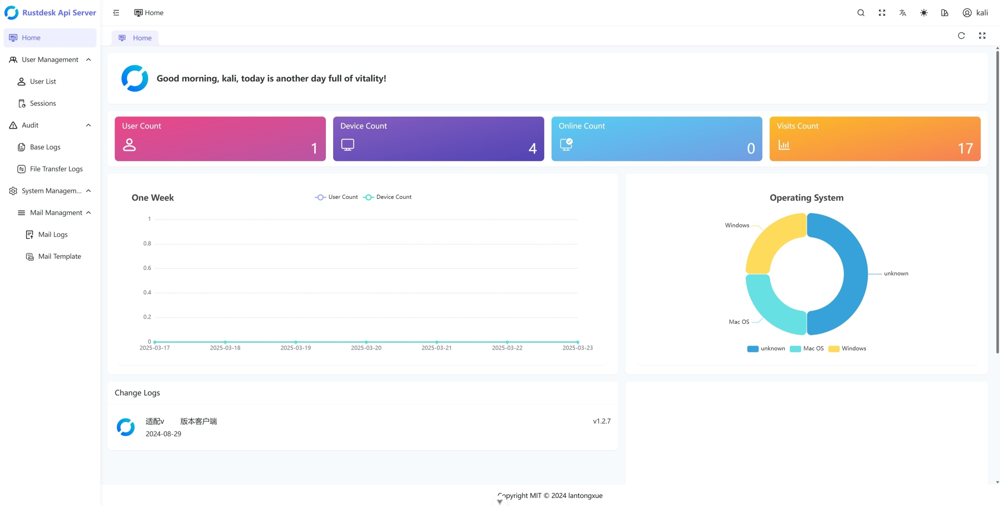

# Rustdesk Api Server Pro

[简体中文](./README.md) | [English](./README_EN.md)

An API server implementation based on the open-source [RustDesk](https://github.com/rustdesk/rustdesk) client, with a bundled Web admin UI (`soybean-admin`).

> Warning: Some compatibility updates in this fork were generated/assisted by ChatGPT. Review the code and test thoroughly before production use.

## Docs (Chinese-first, shown on repository homepage)

- [Usage Guide (Chinese)](./docs/USAGE.md)
- [Ports & Paths Guide (Chinese)](./docs/PORTS.md)
- [Troubleshooting Manual (Chinese)](./docs/TROUBLESHOOTING.md)

## Current Status

- This branch is positioned as a compatibility-enhanced edition focused on newer RustDesk client API behavior
- Sponsorship / payment QR UI and related copy have been removed
- The repository default README is now Chinese (switch to English via the links above)
- The project is still planned to be rewritten: <https://github.com/lantongxue/rustdesk-api-server-pro/issues/30>

## Project Positioning (Detailed)

This project is a third-party API server implementation for the RustDesk client ecosystem. The current goal is to provide a usable client-facing API + basic admin UI while keeping deployment lightweight and maintenance practical.

The current branch prioritizes:

- Compatibility first: keep newer clients working and avoid common 404/field mismatch issues
- Lightweight deployment: sqlite by default, simple self-hosting experience
- Iterative upgrades: add compatibility layers as official client API usage evolves

Typical use cases:

- Self-hosted RustDesk API + admin backend deployments
- Studying or testing RustDesk client API behavior
- Internal customization on top of an existing third-party API server base

Important: some advanced capabilities are still compatibility-level implementations and are not equivalent to the official Pro server.

## Compatibility Scope (Current Code State)

- Compatible with common newer-client API flows:
  - Login / logout / current user / login-options
  - Address book (old + new APIs), including notes
  - Basic group panel requests (users/peers/device-group accessible endpoints)
  - Heartbeat / sysinfo / audit upload and audit note update
  - Minimal `devices/cli` update support
  - Minimal `record` upload protocol (`new/part/tail/remove`)
- Added compatibility endpoints (to avoid 404):
  - `/api/oidc/auth`
  - `/api/oidc/auth-query`
  - `/lic/web/api/plugin-sign`

### Key Compatibility Upgrades Added (vs older third-party versions)

- Address-book `note` field read/write + sync support
- New address-book incremental update fields (`username`, `hostname`, `platform`, etc.)
- Group panel request compatibility (`device-group/accessible`, accessible users/peers)
- Minimal `devices/cli` write-back support (device/address-book related fields)
- Minimal `record` upload protocol with local file persistence
- Stable `sysinfo_ver` response to reduce unnecessary repeated `sysinfo` uploads
- Audit note update compatibility (`PUT /api/audit`)

## Not Full Official Pro Behavior

- `OIDC` endpoints return compatibility responses (full login flow not implemented)
- `plugin-sign` is a compatibility placeholder (not the official signing service)
- `device-group/accessible`, `users?accessible=`, and `peers?accessible=` are compatibility models, not the full official Pro permission model

### Release Decision Guidance

- If your goal is "latest client main flows work": this version is release-ready
- If your goal is "full official Pro parity": continue implementing OIDC, plugin signing, and the full permission model before release

## Tech Stack

- Backend: Go (Iris)
- Frontend: Vue 3 + Vite + Naive UI (`soybean-admin`)
- Database: SQLite (default) / MySQL (optional)

## Project Structure

- `backend/`: Go backend API server
- `soybean-admin/`: Admin frontend
- `docker/`: Container-related files
- `img/`: README image assets

## Recommended Pre-Release Checklist

1. Sync database schema: `rustdesk-api-server-pro.exe sync`
2. Restart the service
3. Run a smoke test with the latest RustDesk client (login, address book, group panel, device list, audit)

### Suggested Smoke Tests (Detailed)

- Login/logout and `currentUser` response
- Address-book create/update/delete and note persistence
- Group panel loads without errors (even if no real device groups exist)
- Device list loads and renders expected fields
- Audit logs are recorded and audit note update works
- If recording upload is enabled: ensure `record_uploads/` is writable

## Notes

- GitHub UI language (buttons/tabs/labels such as `README` or `Commits`) is controlled by GitHub/browser settings, not repository files.
- This README describes the current branch status and compatibility scope.
