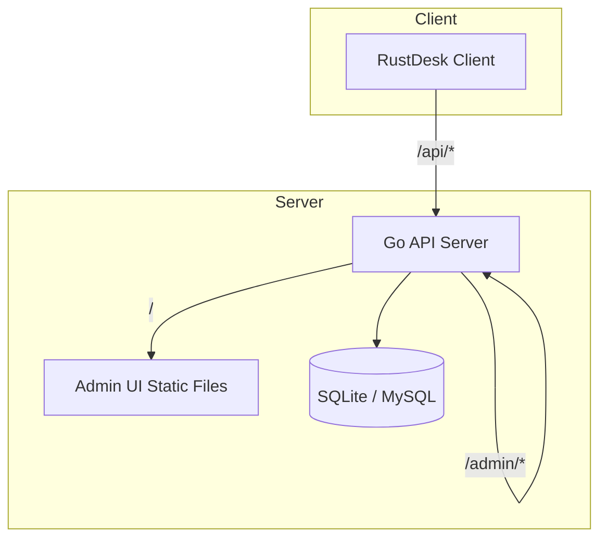
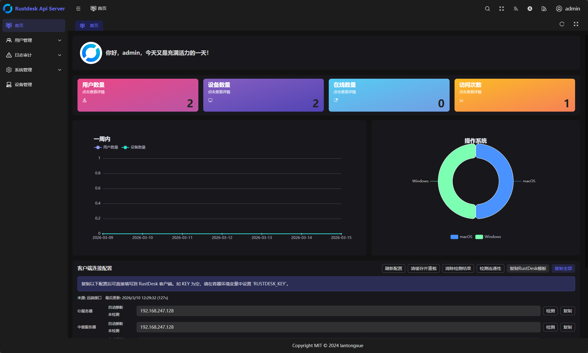

# RustDesk API Server Pro (Compatibility Enhanced)

[中文说明](./README.md)

RustDesk API Server Pro is a third‑party API server implementation for the RustDesk client, bundled with an admin UI (`soybean-admin`). This edition focuses on compatibility with the latest client workflows while keeping deployment lightweight and maintainable.

This is the English full README. It includes feature list, architecture, deployment, configuration, screenshots, FAQ, and license. For deep‑dive topics, see the linked docs at the end.

## Contents

- Overview
- Features
- Architecture
- Repository Layout
- Quick Start
- Configuration (server.yaml)
- Ports and Routes
- Admin UI and Accounts
- Data and Persistence
- Production Recommendations
- Upgrade and Migration
- FAQ and Troubleshooting
- Screenshots
- Documentation Index
- License

## Overview

The project exposes everything on a single HTTP port:

- RustDesk client API (`/api/*`)
- Admin API (`/admin/*`)
- Admin UI static assets (`/`)

SQLite is the default database, and MySQL is supported. Configuration lives in `backend/server.yaml` (container runtime file is `/app/data/server.yaml`).

## Features

- Compatibility‑enhanced RustDesk client API
- Address book read/write with `note` field compatibility
- Device list, user list, and audit logs
- Minimal compatibility for heartbeat, sysinfo, devices/cli
- Minimal record upload flow for `/api/record` (`new/part/tail/remove`)
- Admin UI (`soybean-admin`) served as static files
- OIDC and plugin‑sign placeholder endpoints to avoid 404
- SMTP configuration placeholder for admin notifications/templates

Note: some advanced capabilities are placeholders. See the FAQ section.

## Architecture



## Repository Layout

- `backend/` Go backend API service
- `soybean-admin/` Admin frontend (built and served by backend)
- `docker/` Container scripts and helpers
- `docs/` Usage, ports, Docker, troubleshooting
- `docker-compose.yaml` Compose example
- `Dockerfile` Image build file

## Quick Start

### Option 1: Binary

1. Build

```powershell
go build -o rustdesk-api-server-pro.exe .
```

2. Prepare `backend/server.yaml`

3. Sync DB schema

```powershell
./rustdesk-api-server-pro.exe sync
```

4. Start

```powershell
./rustdesk-api-server-pro.exe start
```

Admin UI: `http://<host>:<port>/`

### Option 2: Docker Compose (Recommended)

```bash
mkdir -p /opt/rustdesk-api-server-pro/data
cd /opt/rustdesk-api-server-pro

# Prepare server.yaml (copy from backend/server.yaml and edit)

cat > docker-compose.yaml <<'YAML'
services:
  rustdesk-api-server-pro:
    container_name: rustdesk-api-server-pro
    image: ghcr.io/liyan-lucky/rustdesk-api-server-pro:latest
    environment:
      - "ADMIN_USER=admin"
      - "ADMIN_PASS=ChangeMe123!"
    volumes:
      - ./server.yaml:/app/server.yaml
      - ./data:/app/data
    network_mode: host
    restart: unless-stopped
YAML

docker compose up -d
```

`ADMIN_USER` and `ADMIN_PASS` create the admin account on first boot only.

## Configuration (server.yaml)

Key file: `backend/server.yaml` (container runtime file is `/app/data/server.yaml`).

Minimal reference:

```yaml
signKey: "please-change-this-sign-key"
debugMode: false

db:
  driver: "sqlite"
  dsn: "./server.db"
  timeZone: "Asia/Shanghai"
  showSql: false

httpConfig:
  printRequestLog: false
  staticdir: "/app/dist"
  port: ":12345"

smtpConfig:
  host: "127.0.0.1"
  port: 1025
  username: ""
  password: ""
  encryption: "none"
  from: "noreply@example.com"
```

Important notes:

- Always change `signKey`
- `httpConfig.port` is the public HTTP port
- `httpConfig.staticdir` is the admin UI static directory
- SQLite database is stored as `server.db` under the runtime working directory
- MySQL is supported by switching `db.driver` and `db.dsn`

## Ports and Routes

Single‑port layout (example `:12345`):

- Admin UI: `/`
- Client API: `/api/*`
- Admin API: `/admin/*`
- plugin‑sign compatibility: `/lic/web/api/plugin-sign`

If `/api` works but `/` is 404, check `httpConfig.staticdir`.

## Admin UI and Accounts

- Admin UI entry: `http://<host>:<port>/`
- Docker first boot can auto‑create admin with `ADMIN_USER` + `ADMIN_PASS`
- For manual adjustments, use in‑container commands or update the database

## Data and Persistence

Persist `/app/data` to keep:

- `server.db` (SQLite)
- `server.yaml` (effective config)
- `.init.lock` (first‑boot marker)
- `record_uploads/` (recording uploads)

Without persistence, data will be lost across restarts.

## Production Recommendations

- Change `signKey`
- Pin `httpConfig.port`
- Use a reverse proxy (Nginx/Caddy) for 80/443
- Enable `printRequestLog` only for debugging
- Run a quick smoke test with the latest RustDesk client

## Upgrade and Migration

Run on each upgrade:

```bash
rustdesk-api-server-pro sync
```

Then restart the service. Missing schema sync can break pages after login.

## FAQ and Troubleshooting

Q: Admin UI not accessible but `/api/*` works

A: `httpConfig.staticdir` is incorrect or frontend not built. Point to `soybean-admin/dist`.

Q: Pages break after upgrade (SQL missing field)

A: Run `sync` and restart.

Q: Client shows 404

A: Enable `printRequestLog`, verify routes, and upgrade the server binary.

Q: Record upload fails

A: Ensure `record_uploads/` is writable and disk has space.

Q: OIDC / plugin‑sign doesn’t work

A: These are compatibility placeholders. Full implementation is required if you need them.

## Screenshots



## Documentation Index

- Usage: `docs/USAGE.md`
- Docker: `docs/DOCKER.md`
- Ports: `docs/PORTS.md`
- Troubleshooting: `docs/TROUBLESHOOTING.md`

## License

Licensed under AGPL‑3.0. See `LICENSE` for details.
